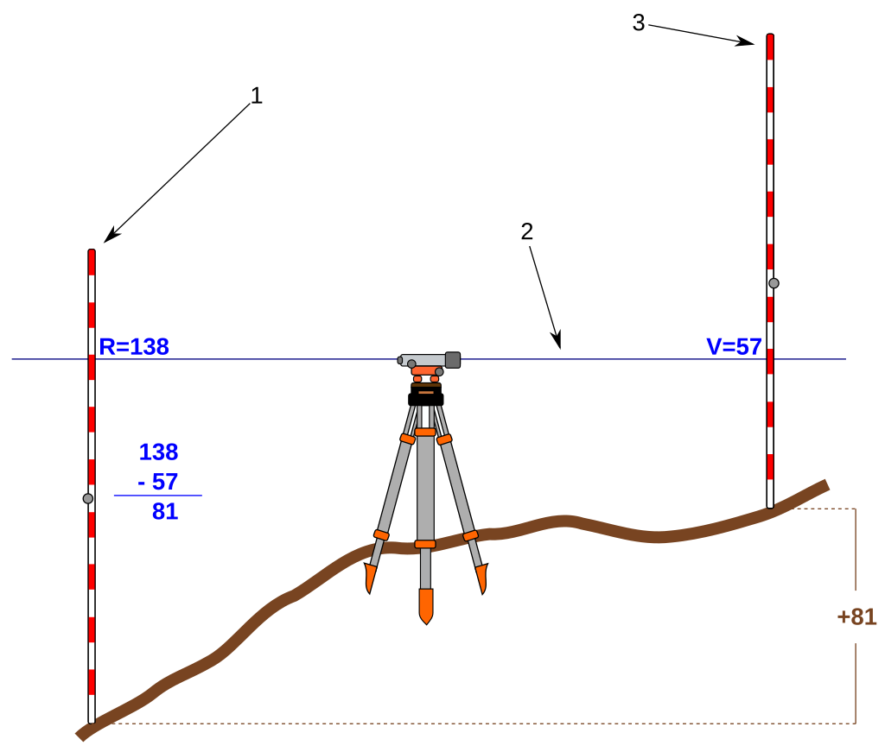

# Field Methods Descriptions - **Levelling**

## Introduction to levelling
To interpret groundwater level measurements in terms of hydraulic gradients, groundwater flow velocities, and directions, it is necessary to relate them to a reference point within a coordinate system (geodetic datum). A commonly used reference point is the sea level. Measurements of groundwater levels (see [ADD LINK LATER]) yield primarily depth to water table with a referring to the top of each well casing/top of observation well. Should these measurements be used to determine gradients, the elevation of the top of the well casing above the common datum, needs to be known.
We speak of levelling, when elevations of points or differences in elevation are determined. When measuring the difference in height ΔH between two points vertical rods are set up on top of the points and a level somewhere between them. The height difference is the difference between the staff readings. Measurements can be continued for multiple points. Possible errors are bad readings from unsteady staff, joint errors (errors of the graduations at the hinges of folding staffs, or between the sections of extension staffs)/
 
Figure: 

## Equipment
* Surveying instrument
* Staff, staff level
* Tripod
## Directions
* Install the instrument at a distance to the measurement point, adjusting the bull’s eye spirit level such that the bubble is centered
* The assistant (A) sets staff on measurement point and holds staff steady, centering the spirit level’s bubble.
* The surveyor (S) takes a first reading, an intermediate shot (IS). The acronym IS and the measurement is noted.
* The A moves the staff to the next measurement point or turning point (TP) while the surveying instrument remains at its location. A TP is a point at which an elevation with a FS is established and a back shot (BS) will subsequently be taken.
* The S takes a front shot (FS) to determine the elevation at the TP. It is noted with the acronym FS
* The S moves the instrument to a point between TP and next measurement point while the A holds the staff at the same location.
* After adjusting the instrument, the S takes a BS and records the measurement with the acronym BS.
* In this manner measurements are carried on.
_Some hints:_
* Try to keep the distance between BS and FS equal to compensate for reading errors.
* On side-hill setups, place one leg on the uphill side and other two on the down-hill side.
* Use hand level to check for proper height of the setup before precisely levelling the instrument.
* Adjusting the bubble:

 
Figure 24. Setting up a level.

## Evaluation
* BS, IS and FS readings are entered in the appropriate columns on different lines. If you change the instrument BS and FS are place on the same line. Insert approximate distance (Dist.).
* The first reduced level (RL) is the height of the datum. Calculate RL for every measurement
* If an IS or FS is smaller than the immediately preceding staff reading then the difference between the two readings is placed in the rise column and vice versa.
* A rise is added to the preceding RL and a fall is subtracted from the preceding RL.
* The RL is the datum of each measurement point. 

Finally check that:

$$ \sum_{i=1}^{n} BS - \sum_{i=1}^{n} FS \equiv \sum_{i=1}^{n} Rise - \sum_{i=1}^{n} Fall = RL_{i=n} - RL_{i=1} $$
