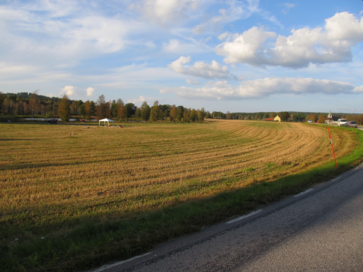
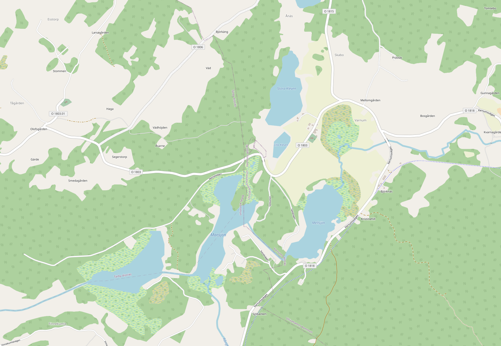

# Field Sites - **Varnum (Sweden)**

## Introduction to the Site, history, and geography
* [Varnum](https://sv.wikipedia.org/wiki/Varnums_distrikt) is situated in the Swedish [province Västra Götalands län](https://sv.wikipedia.org/wiki/V%C3%A4stra_G%C3%B6talands_l%C3%A4n).
* The study site in Varnum is located about 15 km to the Northeast of Borås.
* The study site is ca 3 km2.
* The area is rural with small villages, relatively flat, with lakes and forests. The following figure shows the site.

Figure: 

<figure>
  
  <figcaption>Field site in Varnum/Sweden.</figcaption>
</figure>

* Groundwater reservoir is located in between several lakes (Stora Kleven, Lilla Kleven Mellansjön, Marsjön)
* Approximately 80 000 people are connected to municipal water in Borås.
* Present water reservoir (Öresjö) is exposed to large risk due to roads, railroads, and industry.
* Groundwater is convenient and cost-effective.
* In 1992, a groundwater exploration was conducted throughout the municipal and adjacent area, in order to identify important groundwater assets and possible surface water reservoirs.
* A more detailed study was conducted in 1998, where areas of artificial infiltration (from surrounding lakes) was sought after.

Figure: 

You can see (and modify) the map of Varnum on [OpenStreetMap](https://www.openstreetmap.org/relation/7722209#map=14/57.82414/13.14651)

## Geological characterization

## Available infrastructure

## Available data